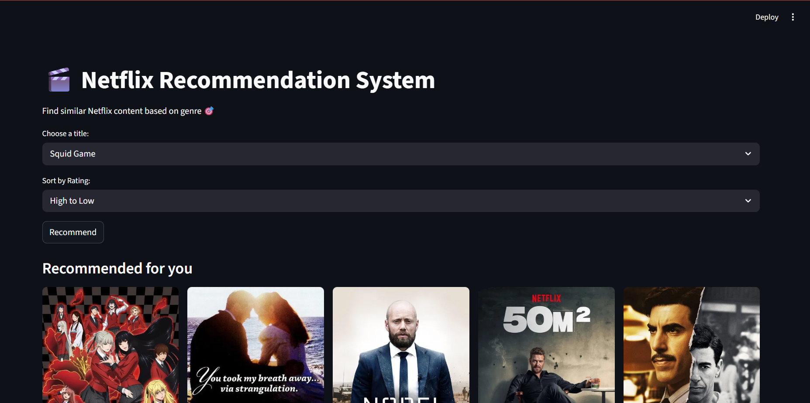

# Netflix Recommendation System

A Netflix-style recommendation system built using Python, Streamlit, Machine Learning, and TMDb API.

## Features

- Netflix-style recommendation system
- Content-based filtering using cosine similarity
- Movie & TV show posters
- Ratings and overviews from TMDb API
- Sort recommendations by rating
- Interactive Streamlit UI

## Technologies Used

- Python
- Pandas
- Scikit-learn
- Streamlit
- TMDb API

## Dataset

Netflix Movies and TV Shows Dataset

## Run Locally

```bash
pip install -r requirements.txt
streamlit run app.py
```

## Screenshots



## Author

Bilal
